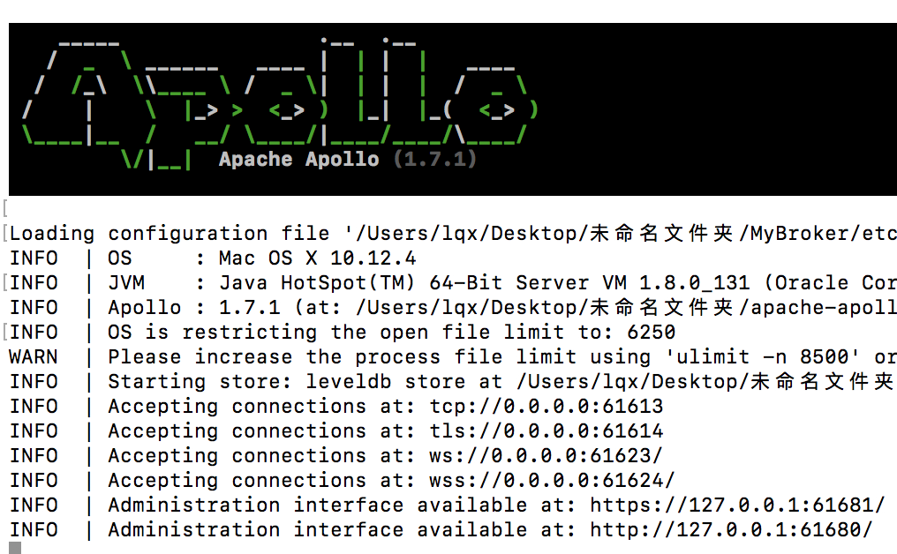

# MQTT开发记录

**作者：** 雷巧勋

## 前言

每一次学习都应该有所收获，为了方便以后回顾，避免重复造轮记录下学习中摸索的过程是很有必要的。为了研究MQTT该次选择了Apache-Apollo提供的broker来进行研究,其次该网站也可以了解mqtt相关的一些特点。[详情](http://activemq.apache.org/apollo/index.html)

## 目录

* [前言](##前言)
* [JAVA_HOME配置](##JAVA_HOME配置)
* [搭建Broker](##搭建Baoker)
* [体验Mqtt](##体验Mqtt)

## JAVA_HOME配置

一般开发电脑可能都有java环境，万一没有就[安转](http://www.oracle.com/technetwork/java/javase/downloads/jdk8-downloads-2133151.html)一下。

1. 查看java版本 ,没有下载
	//在终端输入下面命令来查看是否有java环境有则显示版本，没有弹出提示框，点详情下载安转即可
	java -version
下载安装成功后再次输入，结果如下：
		
		//视下载jdk版本有所不同
		java version "1.8.0_131"
		Java(TM) SE Runtime Environment (build 1.8.0_131-b11)
		Java HotSpot(TM) 64-Bit Server VM (build 25.131-b11, mixed mode)
		
2. 查看JAVA_HOME

		cd $JAVA_HOME
		//结果
		macbook:Home pro$ 
3. 如果第2步失败，
参考苹果官方说明：[Important Java Directories on Mac OS X](https://developer.apple.com/library/content/qa/qa1170/_index.html)

		ls -l /usr/libexec/java_home
		//result:
		lrwxr-xr-x  1 root  wheel  79  1 11 21:16 /usr/libexec/java_home -> /System/Library/Frameworks/JavaVM.framework/Versions/Current/Commands/java_home	
事实上这并没有定位到真实路径（原因：Mac OSX 10.9以后系统就自带了Java 6的环境，路径在:/Library/Java/JavaVirtualMachines文件夹下）
		
		$cd /Library/Java/JavaVirtualMachines
		$ls
		//result:
		jdk1.8.0_131.jdk//(终于找到我们安转的jdk了)
		
		$/usr/libexec/java_home
		//result:这次就是真实路径
		/Library/Java/JavaVirtualMachines/jdk1.8.0_131.jdk/Contents/Home
		
		$/usr/libexec/java_home -V 
		//result:全部版本JAVA_HOME
		Matching Java Virtual Machines (1):
    	1.8.0_131, x86_64:	"Java SE 8"	/Library/Java/JavaVirtualMachines/jdk1.8.0_131.jdk/Contents/Home

		/Library/Java/JavaVirtualMachines/jdk1.8.0_131.jdk/Contents/Home
		
	
4. 如果2成功找到路径可忽略，否则就需要设置JAVA_HOME了
		
		//跳转到根目录显示查看所有.a配置文件
		cd
		ls -a
		
		添加java_home到.bash_profile文件中
		export JAVA_HOME=$(/usr/libexec/java_home)
		export PATH=$JAVA_HOME/bin:$PATH
		export CLASS_PATH=$JAVA_HOME/lib
*(PS:Mac OSX 10.5之后苹果就建议设置$JAVA_HOME变量到/usr/libexec/java_home)*

再次执行2成功则说明：我们就已经配置好了全局的java的path和classpath环境变量

**PS:卸载旧版本**

		rm -rf jdk1.8.0_06.jdk

## 搭建Baoker

鉴于[Apache-apollo](http://activemq.apache.org/apollo/download.html)较之[Mosquitto](http://mosquitto.org)而言比较方便与直观，该次broker决定用Apache-apollo来作为Mqtt的broker；

**PS:该文这针对Mac其他系统请去[官方](http://activemq.apache.org/apollo)详细了解**

### 下载Apollo

1. 此处由于之针对自己macbook而言选择[OS X](http://apache.fayea.com/activemq/activemq-apollo/1.7.1/apache-apollo-1.7.1-unix-distro.tar.gz)版本下载
2. 将下载好的文件解压到适当的目录（最好单独新建一个方便后续整理）。解压后会apache-apollo-xxx文件夹，该文件夹默认为环境变量${APOLLO_HOME}；
3. 接下来创建broker，有两种方式

		cd 放置broker路径（建议就放在2创建的文件夹中方便以后查看或整理）
		方法一：通过环境变量 （相对路径）创建
		${APOLLO_HOME}/bin/apollo create MyBroker
		//上面是通过环境变量直接创建，如果失败说明之前操作有些问题导致环境变量配置失败。
		方法二：将apollo拖入终端用绝对地址 创建
		xxx/bin/apollo create MyBroker #在当前目录下生成一个mqtt_test目录,其下面包含:
		
		*****运行结果*******
		Creating apollo instance at: MyBroker
		Generating ssl keystore...

		You can now start the broker by executing:  
		 "/Users/lqx/Desktop/未命名文件夹/MyBroker/bin/apollo-broker" run

		Or you can run the broker in the background using:
		 "/Users/lqx/Desktop/未命名文件夹/MyBroker/bin/apollo-broker-service" start
		 

	*PS：此处需要java环境，参考上文JAVA_HOME配置*

	成功后文件目录大致应该是这个样子：

	**bin**  运行脚本
	
 	**etc** 环境配置
 	
 	**data** 存储持久化数据
 	
 	**log**  运行日志
 	
 	**tmp** 临时文件

4.  接下来运行我们的broker
		
		cd MyBroker(3创建的文件夹)
		apollo-broker run

5. 由于apollo提供了可视化web界面（这也就是我选择他的原因），我们在safari中输入
	[http://127.0.0.1:61680/](http://127.0.0.1:61680/)（http访问） 或者 [https://127.0.0.1:61681/](https://127.0.0.1:61681/)（https访问，可用于研究mqtt+ssl）输入用户名密码即可登录（默认用户名：admin 密码：password）

至此属于我们自己的Broker就算搭建完成了

## 体验Mqtt

再一次进入初始解压目录中，打开/examples 其中有一些简单客户端。我们打开其中的mqtt/websocket/index.html即可 点击 connect 后回到broker的可视化观测界面我们就能够看到我们刚刚建立的链接，以及发布的主题（Topic）

进一步开发看你想用哪一种语言咯，mqtt个人感觉在弱网络环境下进行实时通讯是一个绝佳选择（例如被用于智能家居上）

		